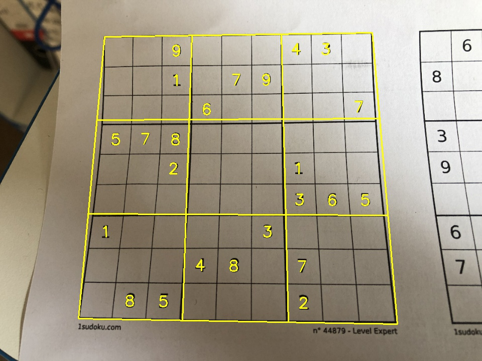

# SudokuReader

An Optical Character Recognition (OCR) program for Sudoku puzzles, written in Python. 
OpenCV was used for image processing.
Tensorflow was used for machine learning.

<figure>

</figure>

## Pipeline

The pipeline is as follows:
1. Read in an image. Optionally resize it.
2. Extract a grid:
    1. Blur to remove noise.
    2. Threshold to obtain areas of high contrast.
    3. Extract the largest contour.
    4. Fit a parallelogram to the largest contour.
3. Warp the image to obtain a straight rectangular grid.
4. Extract numbers:
    1. Assume a fixed step size for the grid (length/9).
    2. In each region of interest (RoI), convolve with a circle kernel. If this is above a threshold, extracted the connected component. 
    3. Centre a new bounding box on this component. Remove all other components.
    4. Pass the new RoI to a Convolutional Neural Network (CNN) and predict the number.
    5. Threshold the result based on the confidence.
6. Project the grid and numbers from the warped image to the original image.

## Sources

The CNN is trained on the number font subset of the Chars74K data set: [www.ee.surrey.ac.uk/CVSSP/demos/chars74k/](http://www.ee.surrey.ac.uk/CVSSP/demos/chars74k/).

Tutorials and inspiration from:
- AI Shack: [aishack.in/tutorials/sudoku-grabber-opencv-detection/](https://aishack.in/tutorials/sudoku-grabber-opencv-detection/)
- PyImageSearch: [www.pyimagesearch.com/2020/08/10/opencv-sudoku-solver-and-ocr/](https://www.pyimagesearch.com/2020/08/10/opencv-sudoku-solver-and-ocr/)
- Solving Sudoku: Part II by Nesh Patel: [medium.com/@neshpatel/solving-sudoku-part-ii-9a7019d196a2](https://medium.com/@neshpatel/solving-sudoku-part-ii-9a7019d196a2)
- LinkedIn post by Raghav Virmani[www.linkedin.com/posts/robovirmani_computervision-ai-ml-activity-6676143042518507520-c2pG/](https://www.linkedin.com/posts/robovirmani_computervision-ai-ml-activity-6676143042518507520-c2pG/)